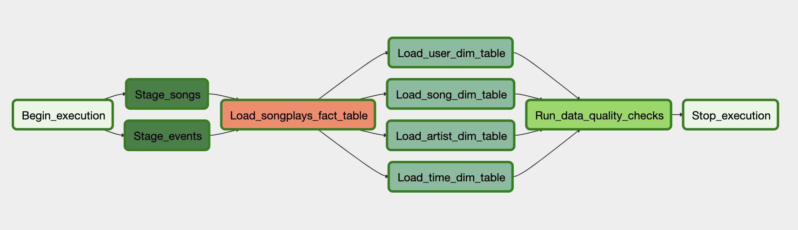

# Project Summary:
In this project we build and configure Apache Airflow for Sparkify to automate and monitor their data warehouse ETL pipelines.

The ETL loads the song and log JSON format data from S3 to staging tables in Redshift and then execute SQL statements to create our fact and dimensions table in Redshift. Airflow automatically schedules this ETL and runs it every hour. It also performs data quality checks to ensure that the data loading has been performed consistently and sucessfully.

Below is the Graph view of the dag implemented

# Explanation of Files in the Repository:
**udac_example_dag.py** is the main project file and contains the tasks and dependencies of the DAG. 

**create_tables.sql** is the file which contains the SQL queries used to create all the required tables in Redshift. For this project it is assumed that these tables already exists in the Sparkify data warehouse in Redshift. If they do not then you will need to create these tables in Redshift first using the SQL statements in this file.

**sql_queries.py** is the file which contains the SQL queries used to run the ETL process with Airflow.

**OPERATOR FILES**

-- **stage_redshift.py** defines StageToRedshiftOperator which is used to copy data from S3 to staging tables in the Redshift data warehouse.

-- **load_dimension.py** defines LoadDimensionOperator which is used to create dimension table from data in the staging tables.

-- **load_fact.py** defines LoadFactOperator which is used to create fact table from data in the staging table.

-- **data_quality.py** defines DataQualityOperator which is used to runs data quality check on the loaded tables and raise error if the the check fails.

# Airflow Configuration:
Use the Airflow Connection options to set up your:

-- AWS credentials

-- Postgres connection to Redshift database
